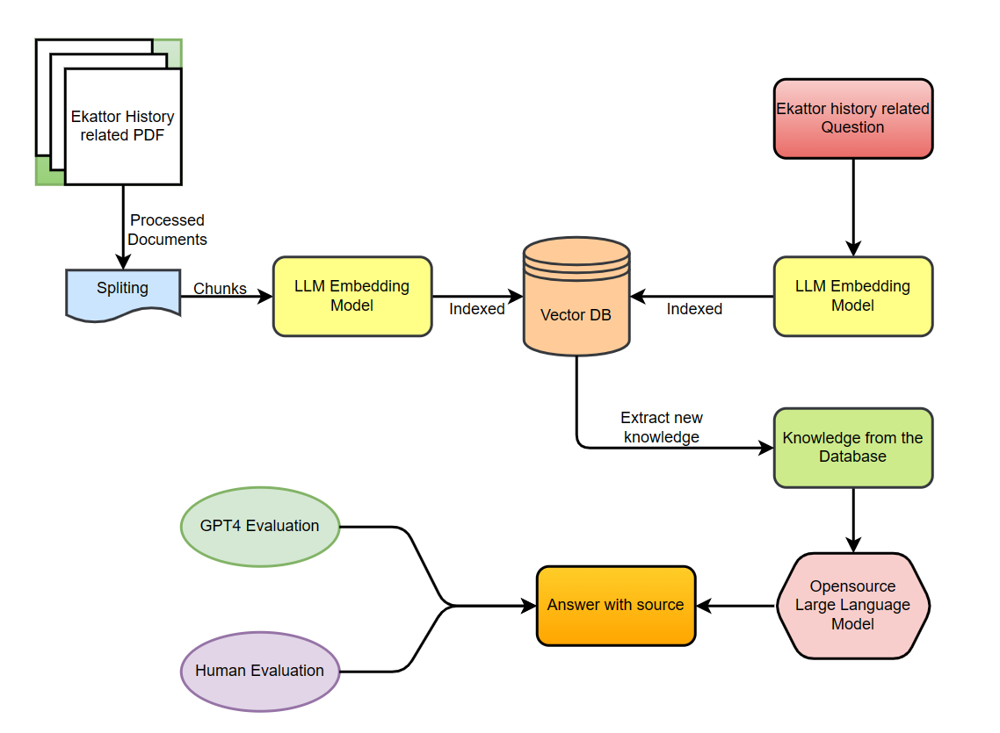
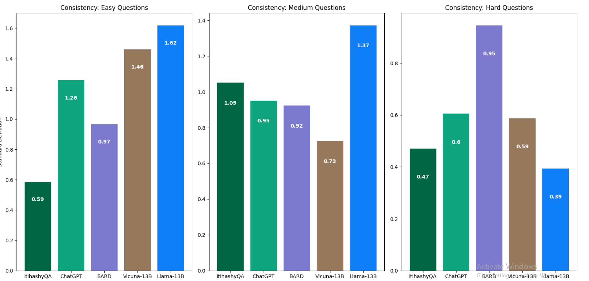

<!DOCTYPE html>
<html lang="en">
<head>
  <meta charset="UTF-8">
  <title>Research Portfolio</title>
  
</head>
<body>

  <h1>🧠 Researcher Portfolio</h1>

  <h3>Technical Skills:</h3>
  
Python, SQL, PyTorch, MATLAB, Qiskit

  

    <h2>🎓 Education</h2>
    
<strong>B.S. in Computer Science & Engineering</strong> 
    North South University – June 2023

  

  

    <h2>🧪 Work Experience</h2>
    <h3>Research Assistant @ Dr. Razib Hayat Khan, North South University</h3>
    
<em>Aug 2023 – Mar 2024</em>

    <ul>
      <li>Developed a data-driven Android app to support children with ASD</li>
      <li>Connected users with schools, doctors, and NGOs</li>
    </ul>
  

  

    <h2>📁 Projects</h2>

    <h3>🔍 AI-Driven Historical QA</h3>
    
Retrieval-Augmented Conversational AI model focused on Bangladeshi history, built to minimize hallucinations using verified data sources.

    
    

    <h3>🔐 Chaos & Quantum Entanglement for Secure Image Transmission</h3>
    

      Combines QKD (E91) and chaotic maps to protect optical data transmission. 
      📄 <a href="https://arxiv.org/abs/2311.18471" target="_blank">Read on arXiv</a>
    

    

    <h3>🤝 We-Care</h3>
    

      Android app that connects families of children with ASD to schools, doctors, and NGOs. 
      📱 <a href="https://github.com/Remian-9080/CSE-299_ASD-HELP" target="_blank">GitHub Repo</a>
    

  

</body>
</html>
